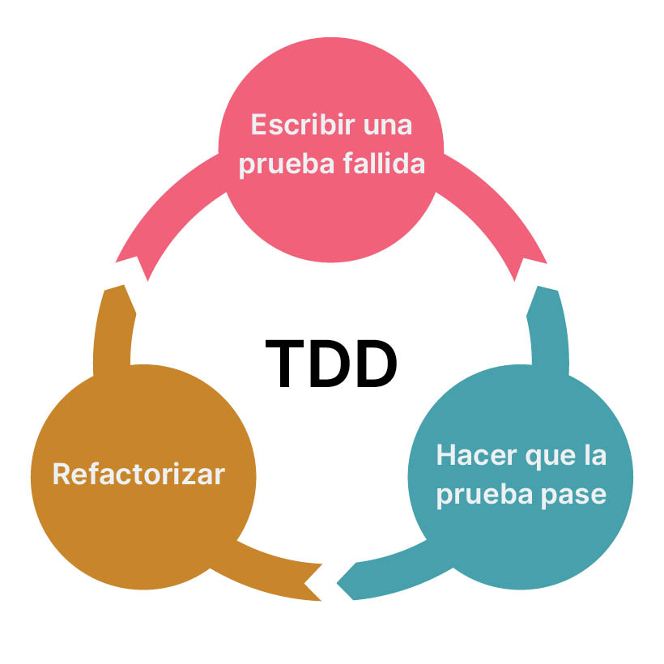

# Introducción a Python

## Semana 10
<!-- .element style="text-align:center" -->

 <!-- .element style="margin-left: auto; margin-right: auto; display: block" -->

---

# Test Driven Development


<!-- .element style="margin-left: auto; margin-right: auto; display: block; height: 500px;" -->

- Se trata de cambiar la forma en la que construimos los programas:


  1) Primero, nos paramos a pensar qué tiene que hacer
  2) Construimos una prueba para comprobar que nuestro programa funciona
  3) Modificamos el programa para que quede mejor (refactorizar)

---

# Ejemplo de TDD

##### Función que sume dos números

Cómo podría ser una prueba:

```python
nombre = "suma de positivos"
res = suma(1,2)
expected = 3

if(res != expected):
    print(f'Test {nombre} fallido')
```

- ¡¡No escribas ni el nombre de la función sin una prueba!!
- Las primeras pruebas se pueden contestar con chorradas
- Define qué es lo que realmente va a hacer la función

---

# Ventajas TDD


- Mejora la calidad del código (puedo "apañarlo" todo lo que quiero sin romperlo)
- Ayuda a diseñar la aplicación (te enfrentas antes a los problemas)
- Aumenta la productividad (pasas más tiempo programando y menos depurando)

<br>

Pero:
- No siempre es útil, sobre todo cuando estás haciendo pruebas de concepto

---

Librerías TDD

---

# ¿Cómo de buena eres realmente?

Había un examen en tu clase y lo has aprobado. ¡Enhorabuena!

Pero eres una persona ambiciosa. Quieres saber si eres mejor que el alumno medio de tu clase.

Recibes las puntuaciones de los exámenes de tus compañeros. Ahora calcula la media y compara tu puntuación.
Devuelve `True` si eres mejor, si no, `False`.

<div></div> <!-- .element style="height: 200px" -->

[Enlace Kata](https://www.codewars.com/kata/5601409514fc93442500010b)

---

# Ordenamiento pseudoalfabético

> He preparado un programa que ordena los números del 1 al 100 en orden alfabético
> es decir: primero los que empiezan por 1, luego por 2, etc. Los que empiezan
> por el mismo dígito los reordena por el dígito que viene a continuación. Así,
> los números quedarían: 1, 10, 100, 11, 12...

¿En qué números coincide el orden numérico con el alfabético?

